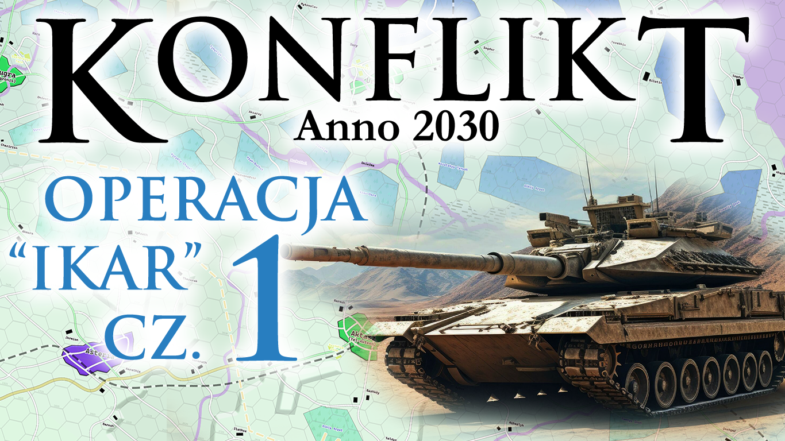
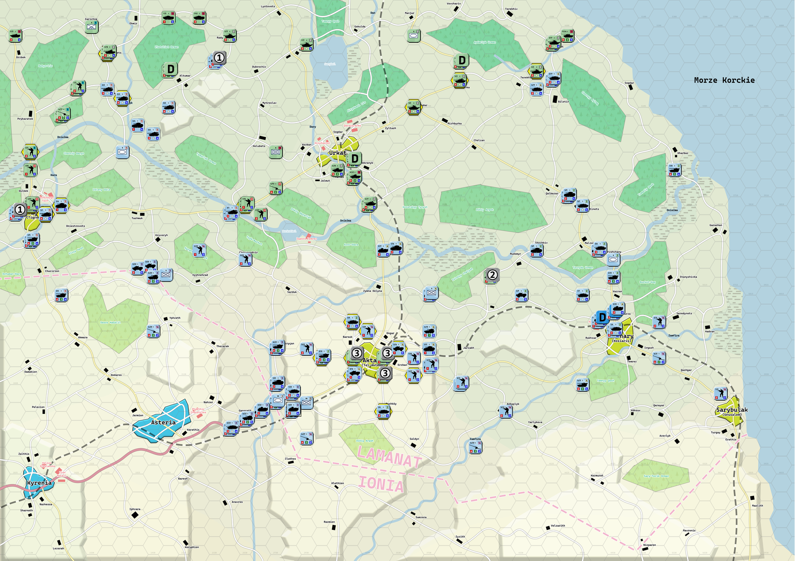

# Konflikt 2030

Projekt wirtualnej adaptacji planszowej gry o konflikcie w upadłym państwie.

## O grze
Konflikt 2030 to wieloosobowa gra strategiczna oparta na systemach World War 3 oraz Bitwy XXI Wieku wydawnictwa Taktyka i Strategia. Instrukcje oraz pełne gry tego wydawnictwa można kupić np. pod tym adresem: https://taktykaistrategiasklep.pl/

Konflikt 2030 pozwala graczom wcielić się w dowódców walczących frakcji w fikcyjnym, ale realistycznym konflikcie zbrojnym toczącym się na terytorium trzech państw: postkomunistycznej Złotarusi, śródziemnomorskiej Ionii oraz upadłego, stepowego państwa Lamanat.

Gracze kontrolują swoje armie na mapie strategicznej, a następnie rozgrywają bitwy taktyczne na mapach geomorficznych, odwzorowujących teren rzeczywisty. Każda decyzja strategiczna wpływa na przebieg walki, a każda wygrana lub przegrana bitwa zmienia sytuację na froncie.

## Strony konfliktu

* 🔴 Złotaruś – post-sowieckie państwo autorytarne, dążące do dominacji w regionie i kontrolowania strategicznych zasobów Lamanatu.
* 🔵 Ionia – śródziemnomorskie państwo nacjonalistyczne, pragnące rozszerzyć swoje wpływy i przywrócić „historyczne ziemie” pod swoją kontrolę.
* ⚫ Lamanat – upadłe państwo, którego terytorium stało się areną walk pomiędzy Złotarusią a Ionią.

## Kluczowe cechy gry

* ✅ Asymetryczna wojna – każda ze stron ma inne cele, zasoby i doktryny wojenne.
* ✅ Walka w zróżnicowanym terenie – od bagiennych lasów Złotarusi, przez klifowe wybrzeża Ionii, po otwarte stepy Lamanatu.

Screenshot z gry

## Tło fabularne
Po upadku centralnego rządu w Lamanacie, kraj pogrążył się w chaosie. Złotaruś i Ionia, rywalizujące o kontrolę nad regionem, rozpoczęły działania wojenne, by przejąć strategiczne tereny i zasoby. Konflikt szybko wymknął się spod kontroli, przeradzając się w pełnoskalową wojnę.

Każdy gracz wciela się w jednego z dowódców walczących stron, podejmując decyzje o ruchach wojsk, atakach i obronie. Sukces zależy od strategii, współpracy i umiejętności dowodzenia.

## Wiki

https://conflict2030.miraheze.org/wiki/Strona_g%C5%82%C3%B3wna

## Autor

Dariusz Janicki (2024)