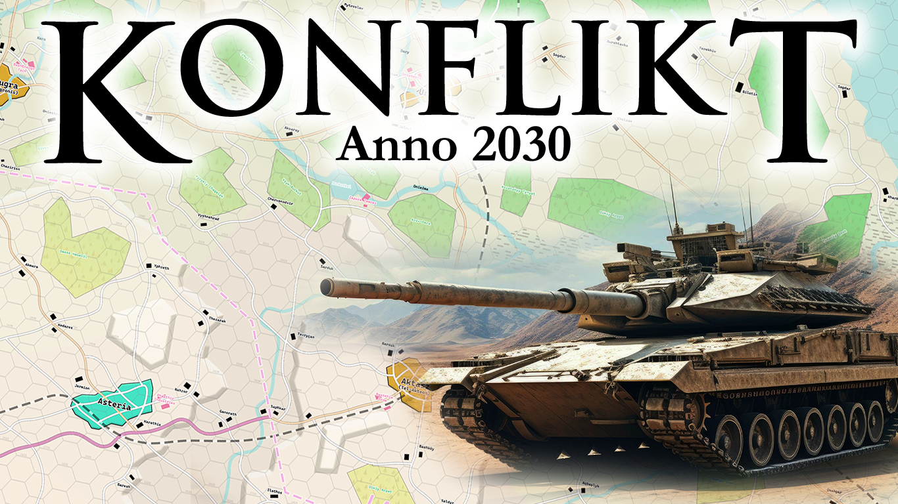
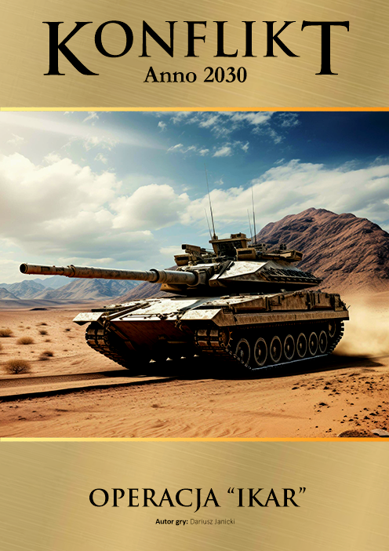
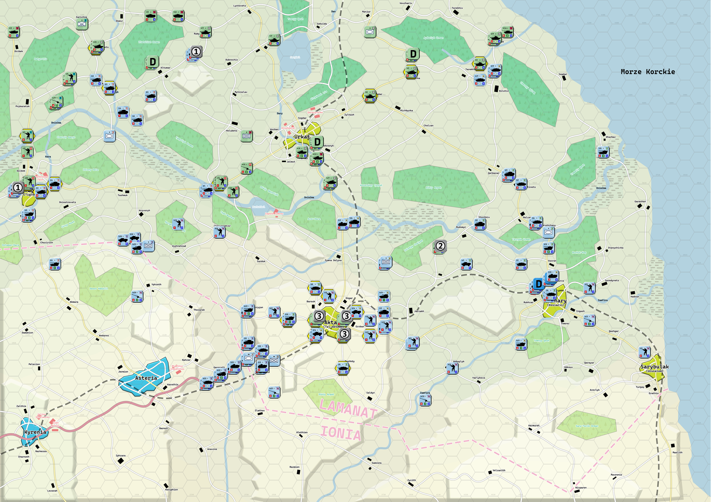

# Konflikt 2030

Projekt wirtualnej adaptacji planszowej gry o konflikcie w upadłym państwie.

## O grze
Konflikt 2030 to wieloosobowa gra strategiczna zrealizowana w silniku Vassal w systemie World War 3 (WW3) wydawnictwa Taktyka i Strategia.
Gry i instrukcje do systemu można zakupić m.in. tutaj:

* 👉 System WW3 Taktyka i Strategia https://taktykaistrategia.pl/kategoria-produktu/nasze-gry/?filter_system=ww3&query_type_system=or
* 👉 Sklep Taktyka i Strategia https://taktykaistrategiasklep.pl/

## Opis konfliktu

Konflikt 2030 pozwala graczom wcielić się w dowódców walczących frakcji w fikcyjnym, ale realistycznym konflikcie zbrojnym.

* 🟡 Złotaruś – post-sowieckie państwo autorytarne, dążące do dominacji w regionie i kontrolowania strategicznych zasobów Lamanatu.
* 🔵 Ionia – śródziemnomorskie państwo nacjonalistyczne, pragnące rozszerzyć swoje wpływy i przywrócić „historyczne ziemie” pod swoją kontrolę.
* 🟢 Lamanat – upadłe państwo, którego terytorium stało się areną walk pomiędzy Złotarusią a Ionią.

## Wiki

Głębszy opis świata Konflikt 2030 jest zamieszczony w poniższym Wiki:

https://conflict2030.miraheze.org/

## Kluczowe cechy gry

* ✅ Asymetryczna wojna – każda ze stron ma inne cele, zasoby i doktryny wojenne.
* ✅ Walka w zróżnicowanym terenie – od bagiennych lasów Złotarusi, przez klifowe wybrzeża Ionii, po otwarte stepy Lamanatu.

## 📁 Struktura repozytorium

``` yaml
Konflikt-2030/
│
├── Konflikt 2030 - Operacja Ikar.vmod          # Podstawowy moduł Vassal z pierwszym scenariuszem - Operacja "Ikar".
├── resources/                                  # Wspólne zasoby: ikonki, dźwięki, itp.
├── b-21/                                       # W założeniach, Konflikt 2030 miał rozgrywać starcia w systemie B-21, 
│                                               # w tym katalogu znajdują się grafiki geomorficznych plansz
└── scenarios/                                  # Katalogi scenariuszy:
  └── [nazwa_scenariusza]/
    ├── graphics/                               # Mapy, jednostki, okładki, screeny
    ├── scenario/                               # Opisy scenariuszy i zmiany zasad
    ├── psd/                                    # Źródła graficzne (Photoshop)
    ├── saves/                                  # Zapisy do gry (np. rozstawienie początkowe)
    ├── *.vmdx                                  # Rozszerzenie do głównego modułu
    └── *.vmod                                  # Czasem osobny moduł dla danego scenariusza
```

## 🎲 Scenariusze

---

### 1️⃣ Operacja "Ikar"



Nacjonalistyczna Ionia uderza od południa na pogrążoną w kryzysie Islamistyczną Republikę Lamanatu, próbując odzyskać historyczne ziemie.

<details>
<summary>➡️ Operacja "Ikar" - więcej informacji</summary>


Po upadku centralnego rządu w Lamanacie, kraj pogrążył się w chaosie. Złotaruś i Ionia, rywalizujące o kontrolę nad regionem, rozpoczęły działania wojenne, by przejąć strategiczne tereny i zasoby. Konflikt szybko wymknął się spod kontroli, przeradzając się w pełnoskalową wojnę.

Każdy gracz wciela się w jednego z dowódców walczących stron, podejmując decyzje o ruchach wojsk, atakach i obronie. Sukces zależy od strategii, współpracy i umiejętności dowodzenia.

</details>

### 2️⃣ Manewry "Wostok" (w przygotowaniu)
### 3️⃣ Szturm na Bajkar (w przygotowaniu)

## Autor

* Dariusz Janicki, 2024 satanjamnic@gmail.com